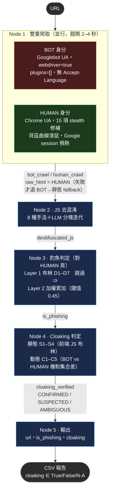

# Cloaking / Phishing 偵測

同一個 URL，用同一支判斷函式，回答兩個互相獨立的問題：**是不是釣魚站**、**有沒有對爬蟲隱藏內容**。

## 核心概念：策略反轉（Strategy Inversion）

傳統反 cloaking 系統想辦法讓爬蟲偽裝得更像真人，跟攻擊者的偵測手段軍備競賽——但只要攻擊者的 bot 偵測夠強，爬蟲永遠追不上。

這個專案反過來做：**故意**用兩個極端身分去爬同一個網址——一個主動暴露「我是機器人」，一個盡力偽裝成真人——如果伺服器端真的有 cloaking，兩份回應就會出現差異，而這個差異本身就是偵測訊號，不需要真的騙過攻擊者的偵測。攻擊者的 cloaking 做得越好，兩份回應差得越明顯，反而越容易被抓到。

## 架構

線性五階段 LangGraph pipeline，**沒有條件路由**——釣魚判定與 cloaking 判定是兩個獨立屬性，任何前後閘門都會讓其中一格變成「未測量」。



`cloaking` 欄位是**三態**：`True`（驗到）/ `False`（驗過確認沒有）/ `N/A`（雙瀏覽器不可信，沒驗）。三者意義不同，不能合併成一個布林。

## 三條設計原則

1. **高特異性用布林，統計性才用累加。** 「合法網站沒有理由做這件事」的特徵（Telegram webhook、憑證表單送去免費主機）→ 連言規則，命中即定案；「合法網站也常做」的特徵（URL 長度、`document.referrer`）→ 只能當佐證累加，永遠不能單獨裁決。兩類混在一起加總，會落入「調高門檻壓誤報 → 漏報變多 → 再調」的死循環。
2. **判釣魚看真人看到的頁面。** 攻擊面是使用者，不是爬蟲——用爬蟲視角的 HTML 判釣魚，等於拿攻擊者想給你看的乾淨頁下結論，cloaking 做得越好越判不出來。
3. **權重要有依據，沒有就別放。** 唯一還在用的權重（Node 3 Layer 2 的 URL 詞彙特徵）用 `Dataset.csv`（116,600 筆標籤 URL）的 Weight-of-Evidence 校準；其餘一律標記為 `unfitted`，不假裝有統計基礎。

## 快速開始

```bash
py -3.12 -m venv .venv
.venv\Scripts\python.exe -m pip install -r requirements.txt
.venv\Scripts\python.exe -m playwright install chromium
```

建立 `.env`（已加入 `.gitignore`）—— 預設走本地 LM Studio，先在 LM Studio 開 Local Server：

```
LLM_PROVIDER=lmstudio
LLM_MODEL=<Local Server 分頁顯示的確切 model identifier>
```

執行（自動讀取同目錄 `urls.txt`，每行一個網址）：

```bash
python main.py
```

單一網址時直接印出報告；多個網址走批次模式，並行執行、輸出彙整表格與 `csv_reports/` 下的 CSV。未設定 API key 時所有 LLM 節點自動退化為純規則模式，不會崩潰。

### LLM 供應商

| Provider | 說明 |
|---|---|
| `lmstudio`（預設） | 本地，免 key（先在 LM Studio 開 Local Server），`LLM_MODEL` 需填 Local Server 分頁顯示的確切 model identifier |
| `deepseek` | 雲端，需要 `DEEPSEEK_API_KEY` |
| `anthropic` | 雲端，需要 `ANTHROPIC_API_KEY` |
| `openai` | 雲端，需要 `OPENAI_API_KEY` |
| `google` | 雲端，需要 `GOOGLE_API_KEY` |

切換回雲端供應商：`$env:LLM_PROVIDER = "deepseek"`（PowerShell）。

## 測試

```bash
python test_node3_phishing.py && python test_node4_cloaking.py && python test_node4_static.py && python test_pipeline_e2e.py
```

23 個測試；`test_pipeline_e2e.py` 用假結果取代 `dual_crawl`，不連網跑完整條 graph。

## 專案結構

| 檔案 | 職責 |
|---|---|
| `main.py` | LangGraph 組裝、LLM 供應商工廠、批次執行、CLI 入口 |
| `state.py` | `AnalysisState` TypedDict |
| `nodes/dual_crawler.py` | BOT/HUMAN Playwright 爬取層 |
| `nodes/node1_scraper.py` | 呼叫雙重爬取、抽取判定用頁面的 JS |
| `nodes/node2_js_analyzer.py` | JS 去混淆（8 種手法 + LLM） |
| `nodes/node3_phishing_classifier.py` | 釣魚判準；`evaluate_page()` 為 Node 3/4 共用入口 |
| `nodes/node4_cloaking_analyzer.py` | 靜態 + 動態 cloaking 判定 |
| `nodes/node5_risk_output.py` | 三欄 CSV 輸出（無風險分數） |

## 文件

- [WORKFLOW.md](WORKFLOW.md) — 每個 Node 的規則表、公式、已知限制，工程細節的完整版本
