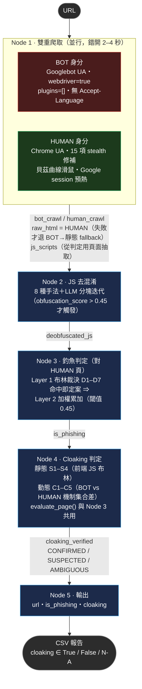

# Cloaking / Phishing 偵測 Workflow

同一個 URL，判斷兩件互相獨立的事：**是不是釣魚站**、**有沒有對爬蟲隱藏內容**。

## 全域設計原則

三條原則貫穿所有節點，看程式碼時對照這三條就懂為什麼那樣寫：

1. **高特異性用布林，統計性才用累加。**
   「合法網站沒有理由做這件事」的特徵（Telegram webhook、憑證表單送去免費主機、ChromeDriver 注入變數）→ 連言規則，命中即定案。
   「合法網站也常做」的特徵（URL 長度、`document.referrer`、`screen.width`）→ 只能累加當佐證，永遠不能單獨裁決。
   把兩類混進同一個加總，就會落入「調高門檻壓誤報 → 漏報變多 → 再調」的循環。

2. **判釣魚看真人看到的頁面。** 攻擊面是使用者，不是爬蟲。用爬蟲視角的 HTML 判釣魚，等於用攻擊者想給你看的乾淨頁下結論。

3. **權重要有依據，沒有就別放。** 目前唯一還在用的權重是 Node 3 Layer 2，其中 URL 詞彙那批用 `Dataset.csv`（116,600 筆）的 WoE 校準過，其餘標了 `unfitted`。

---

## Pipeline



線性，**沒有條件路由**。釣魚與 cloaking 是 2×2 的兩個獨立屬性，任何前後閘門都會讓其中一格變成「未測量」。

---

## Node 1 — 雙重爬取

`nodes/node1_scraper.py` + `nodes/dual_crawler.py`

並行跑兩個 Playwright（錯開 2–4 秒 stagger，讓伺服器先看到爬蟲）：

| | 偽裝方向 | 手段 |
|---|---|---|
| **BOT** | 主動暴露自己是機器人 | Googlebot UA、`_BOT_EXPOSE_JS` 把 `webdriver=true`/`plugins=[]`/`languages=[]` 全部還原、1024×768、無 `Accept-Language`、保留 `AutomationControlled` 旗標 |
| **HUMAN** | 盡可能像真人 | `_STEALTH_JS` 修補 15 個 headless 洩漏點、Canvas/WebGL/Audio 假指紋、Google session 預熱、貝茲曲線滑鼠軌跡 |

**輸出**：`bot_crawl` / `human_crawl`（同結構 dict）、`raw_html` = **HUMAN 那份**（HUMAN 失敗才退回 BOT，再失敗才 `requests` fallback）、`js_scripts`（從判定用頁面抽取）。

可選增強：`CLOAKING_PROXY` 環境變數走住宅代理、裝 `curl_cffi` 讓 TLS JA3/JA4 指紋像真 Chrome。

---

## Node 2 — JS 去混淆

`nodes/node2_js_analyzer.py`

八種手法：Dean Edwards Packer、`eval(atob())`、hex/unicode 跳脫、obfuscator.io 字串陣列、JSFuck/JJencode 偵測、字串常數合併、js-beautify、LLM 分塊迭代（`obfuscation_score > 0.45` 才觸發）。

**為什麼必須在 Node 3/4 之前**：兩者的 regex 都比對可讀原始碼。壓縮成 `n.wD` 的字串比對不到 `navigator.webdriver`。這是整條 pipeline 唯一真正的順序依賴。

---

## Node 3 — 釣魚判定

`nodes/node3_phishing_classifier.py`（對 `raw_html` = HUMAN 頁）

### Layer 1：布林裁決 — 命中即定案，跳過評分與 LLM

| | 條件（AND） |
|---|---|
| D1 | 前端把資料送往 Telegram / Discord / Slack webhook |
| D2 | 憑證表單 action 指向裸 IP |
| D3 | 憑證表單 action 指向免費主機 / 動態 DNS |
| D4 | 品牌名出現在 weebly / pages.dev 類託管平台 |
| D5 | URL 含 `@` 符號 |
| D6 | 憑證表單 + Punycode 同形字網域 |
| D7 | 憑證表單 + 解碼後 eval + 封鎖 DevTools |

收錄標準：①合法網站沒有合理情境會觸發（已扣除 SSO / CDN / analytics 白名單）②攻擊者規避成本高。

### Layer 2：統計累加（閾值 0.45）

弱訊號才進這層。URL 詞彙特徵的權重 = `0.04 × WoE`，係數由一條不變式決定：**全部命中總分 0.43 < 0.45**，所以 URL 特徵永遠只能當佐證。

實測移除的：`dot>=4`（WoE −0.33，是反向證據）。實測新增的：`entropy>4.2`、`digit_ratio>0.1`。未採用：`is_https=0`（WoE −2.02，資料集年代偏誤）。

**`evaluate_page(html, url)`** 是這層的公開入口，Node 4 也呼叫它 —— 兩處必須是同一個實作，否則「BOT 沒有惡意機制」這句話在兩個節點會是兩個意思。

---

## Node 4 — Cloaking 判定

`nodes/node4_cloaking_analyzer.py`

### 靜態：前端 JS（S1–S4，布林）

定義：**偵測環境 → 依結果改變使用者看到的東西**。兩半都不能單獨成立。

| | 條件（AND） |
|---|---|
| S1 | 爬蟲框架洩漏識別符 + 差異化跳轉 |
| S2 | 指紋條件分流 + 差異化跳轉 |
| S3 | 爬蟲偵測 + 指紋條件分流 |
| S4 | LLM 判定 + 高特異性偵測佐證 |

一般性環境偵測（UA / referrer / screen / geo / devtools / mouse）**記錄為證據但不參與裁決** —— 那是統計性特徵，布林化只會把現代網站判成 cloaking。

### 動態：BOT vs HUMAN 機制集合差（C1–C5，布林）

```
hidden_from_bot = evaluate_page(HUMAN).mechanisms − evaluate_page(BOT).mechanisms
```

| | 條件 |
|---|---|
| C1 | HUMAN 有惡意機制而 BOT 沒有 |
| C2 | 爬蟲被封鎖 403/404/503，真人 200 |
| C3 | 爬蟲被 HTTP/2 協議層中斷 |
| C4 | 爬蟲拿到空頁面，真人拿到完整內容 |
| C5 | Redirect 分叉且只有真人端落在含惡意機制的頁面 |

明確區分三種「不是 cloaking」：兩端都有惡意機制（是釣魚但沒藏）、兩端都乾淨、分叉但機制相同（地理導向）。

**為什麼不用文字相似度**：相似度低 ≠ cloaking（多語言、A/B test、個人化）；相似度高 ≠ 沒有 cloaking（只塞一支外洩腳本可以到 0.98）。相似度仍然計算並列印，但標記「不參與判定」。

### 可信度分級

`CONFIRMED`（雙瀏覽器可信 + 實驗確認）/ `SUSPECTED`（單側證據或動態不可信）/ `AMBIGUOUS`（兩端一致且可信 → 沒有 cloaking）。

---

## Node 5 — 輸出

`nodes/node5_risk_output.py` → `csv_reports/phishing_report_<時間戳>.csv`

```
url,is_phishing,cloaking
```

`cloaking` 是**三態**：`True` / `False` / `N/A`。「沒驗到」和「驗過沒有」是兩件事 —— 雙瀏覽器 `LOW`/`FAILED` 時寫 `N/A`，不謊稱已確認無 cloaking。

沒有風險分數：判定已經在 Node 3/4 用布林做完，再把兩個布林乘權重合成 0~1 的數字，只是把明確的結論重新變回需要解釋的東西。

---

## 環境安裝

```bash
py -3.12 -m venv .venv
.venv\Scripts\python.exe -m pip install -r requirements.txt
.venv\Scripts\python.exe -m playwright install chromium
```

`requirements.txt` 只列實際會 import 的套件（核對過，沒有用不到的東西）；`langchain-anthropic`/`langchain-google-genai` 是延遲 import，缺套件會提示而非崩潰。`curl_cffi` 是選用增強（TLS 指紋偽裝），註解在檔案裡，要用才裝。

日常開發用 VS Code 要記得把直譯器切到這個 `.venv`（右下角狀態列或 `Ctrl+Shift+P` → `Python: Select Interpreter`），否則會撿到系統上其他 Python 安裝，版本對不上、Playwright 瀏覽器快取版本也可能不一致。

## 執行

```bash
python main.py
```

環境變數：

| | 說明 |
|---|---|
| `LLM_PROVIDER` | `lmstudio`（預設）/ `deepseek` / `anthropic` / `openai` / `google` |
| `<PROVIDER>_API_KEY` | 對應的 key；未設定則所有 LLM 節點退化為純規則模式（`lmstudio` 例外，見下）|
| `LLM_MODEL` | 覆寫預設模型 |
| `CLOAKING_PROXY` | 住宅代理（可選） |

⚠️ Claude 5 系列已移除 `temperature` / `top_p` / `top_k`，送出直接回 400 —— `_make_llm` 依供應商決定要不要帶。

### 接 LM Studio（本地模型）

LM Studio 開的是本地 OpenAI 相容端點，跟 `deepseek` 走同一條 `ChatOpenAI(base_url=...)` 路徑，不用裝新套件。

```bash
# 1. LM Studio 內開啟 Local Server（預設 port 1234），載入想用的模型
# 2. 設定環境變數並啟動
$env:LLM_PROVIDER = "lmstudio"
$env:LLM_MODEL    = "<Local Server 分頁顯示的確切 model identifier>"
python main.py
```

| | 說明 |
|---|---|
| `LMSTUDIO_API_KEY` | 選填，LM Studio 不驗證這個值，不設定會自動帶入佔位字串 |
| `LMSTUDIO_BASE_URL` | 選填，預設 `http://localhost:1234/v1` |
| `LLM_MODEL` | **幾乎一定要設**——多模型時 LM Studio 靠這個欄位路由到已載入的模型，隨便填字串可能連不到 |

本地推理通常比雲端 API 慢，若常常 timeout，直接調大 `main.py` 裡 `llm_code`/`llm`/`llm_cloak` 三個 `_make_llm()` 呼叫的 `timeout` 參數即可（純數字，沒有另外的設定系統）。

## 測試

```bash
python test_node3_phishing.py && python test_node4_cloaking.py && python test_node4_static.py && python test_pipeline_e2e.py
```

23 個測試。`test_pipeline_e2e.py` 把 `dual_crawl` 換成假結果，不連網跑完整條 graph。

## 檔案

| 檔案 | 行數 | 職責 |
|---|---|---|
| `main.py` | 579 | LangGraph 組裝、LLM 供應商工廠（5 種）、批次執行、CLI |
| `state.py` | 26 | `AnalysisState` TypedDict |
| `nodes/dual_crawler.py` | 750 | BOT/HUMAN Playwright 爬取層 |
| `nodes/node1_scraper.py` | 179 | 呼叫雙重爬取、抽 JS |
| `nodes/node2_js_analyzer.py` | 355 | 去混淆 |
| `nodes/node3_phishing_classifier.py` | 1191 | 釣魚判準（`evaluate_page` 為共用入口）|
| `nodes/node4_cloaking_analyzer.py` | 669 | 靜態 + 動態 cloaking 判定 |
| `nodes/node5_risk_output.py` | 97 | 三欄 CSV 輸出 |

（`nodes/__init__.py` 16 行，純匯出，不列職責）

---

## 已知限制

1. **Node 4 的機制比對吃原始 HTML，不吃去混淆結果。** 兩端對等，但混淆過的釣魚頁可能兩端都測不出機制（`code_obfuscation_exec` 這個 flag 部分擋住）。修法是對兩份 HTML 都跑去混淆，代價是 LLM 成本 ×2。
2. **HTML/JS 規則的權重與門檻無資料依據。** `Dataset.csv` 只有 URL 欄位，能校準的只有 Node 3 的詞彙層。
3. **Node 2 的 LLM 去混淆（timeout 240s）是剩下最貴的一塊**，且它是唯一擋住 Node 3/4 平行化的依賴。
4. **`PHISHING_CONFIDENCE_THRESHOLD = 0.45` 是全系統唯一剩下的魔術數字。** 可以用 `Dataset.csv` 校準，做法同 WoE 那次。
